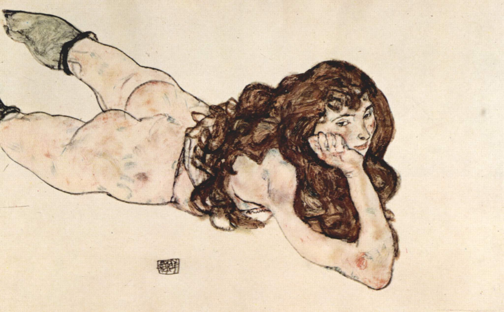

Apart from academics, I have a deep interest in literature, art, music, films and other arts. If you want to get to know me better, here’s a list of some of my tastes

#### Literature
- Bolaño, Roberto. *2666*   
- Quiroga, Horacio. *Stories of Love, Madness and Death*  
- Vargas Llosa, Mario. *The city and the dogs*  
- Cortázar, Julio. *All Fires The Fire*  
- García Márquez, Gabriel. *Love in the Time of Cholera*   
- Joyce, James. *Dubliners*  
- Salinger,J.D. The heart of a broken story. *Esquire*. 1941  
   
<h4>Art</h4>

I am a big fan of Egon Schiele, here are some of my favourites.

  

  
I have systematically read works on modernism art including Baudelaire, T.J. Clark and Clement Greenberg.
  
  

 
  
  
 
  
  
  
  
  

   
   
   
   

